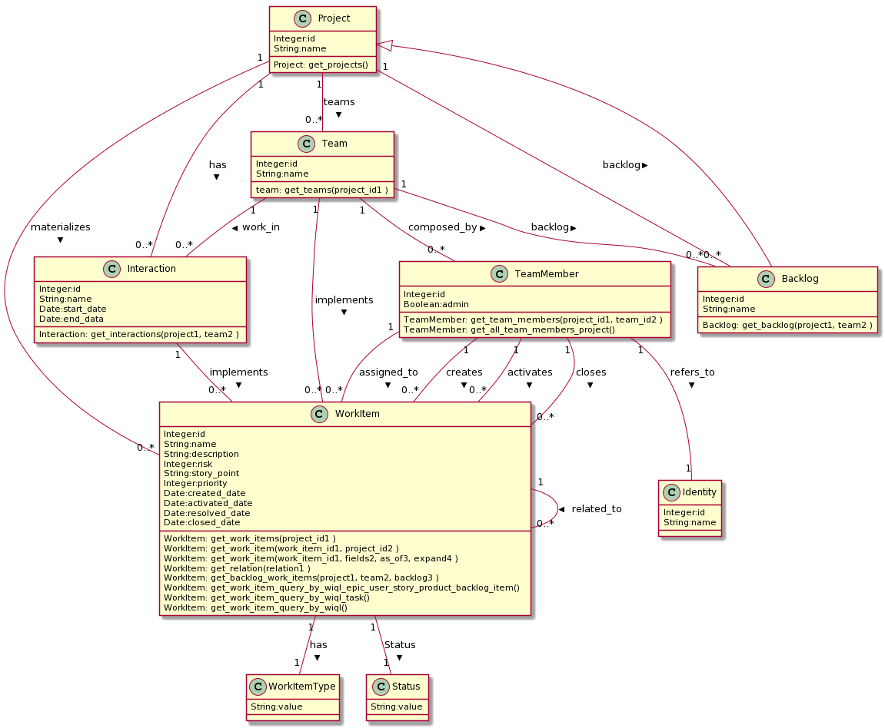

# Documentation

## Application Conceptual Data Model
	
	
## Entities
	
* **Project** : Represents a software Project
* **Backlog** : Represents a Backlog of project and Team
* **Team** : Represents the teams in a project
* **Interaction** : Represent the time-box in a project s
* **TeamMember** : Represent a team member
* **Identity** : Represent a person
* **WorkItem** : Represent a item of work in a project
* **WorkItemType** : Represent a type of Workitem 
* **Status** : Represent a status of Workitem 

## Functions of Project:	
* **get_projects ()**: Returns a list of projects
## Functions of Backlog:	
* **get_backlog (project , team , )**: Return a backlog from a project and team
## Functions of Team:	
* **get_teams (project_id , )**: Returns the project's teams
## Functions of Interaction:	
* **get_interactions (project , team , )**: Returns the interactions from a project and team
## Functions of TeamMember:	
* **get_team_members (project_id , team_id , )**: Returns the team member of project and team
* **get_all_team_members_project ()**: Returns all team member of project that user has access
## Functions of WorkItem:	
* **get_work_items (project_id , )**: Return all workitems from a project
* **get_work_item (work_item_id , project_id , )**: Return one workitem from a project
* **get_work_item (work_item_id , fields , as_of , expand , )**: Return one workitem from a project with details
* **get_relation (relation , )**: Return all workitens with relationships
* **get_backlog_work_items (project , team , backlog , )**: Return all workitens from a backlog
* **get_work_item_query_by_wiql_epic_user_story_product_backlog_item ()**: Return all Epic and Story from a backlog
* **get_work_item_query_by_wiql_task ()**: Return all Task
* **get_work_item_query_by_wiql ()**: Return all workitems
		
## Copyright
This lib was PowerRight by [SEON Application Lib Generator](https://gitlab.com/mdd_seon/from_application_conceptual_data_model_2_lib_application) 
